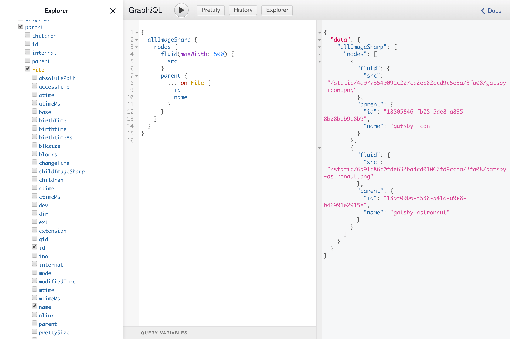

# gatsby-graphiql-explorer

A package to extend the default [GraphiQL][graphiql] IDE with useful features for Gatsby users.

_Note:_ accessible at http://localhost:8000/___graphql after running `gatsby develop`

## Features

- Offline support - for when you need to work on your excellent Gatsby app on a plane, train, or elsewhere off the grid
- [GraphiQL Explorer][graphiql-explorer] - an interactive explorer plugin to visually create and interact with the GraphQL schema
- _All_ the expected features you know and love from [GraphiQL][graphiql]

[graphiql]: https://github.com/graphql/graphiql
[graphiql-explorer]: https://github.com/OneGraph/graphiql-explorer
