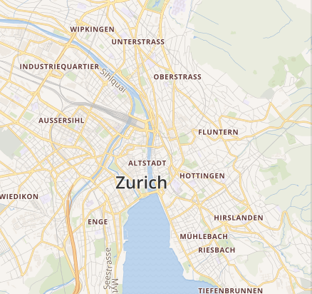
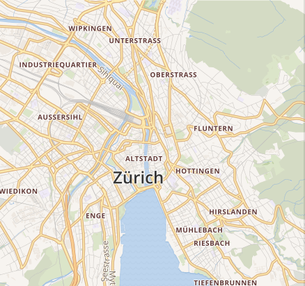
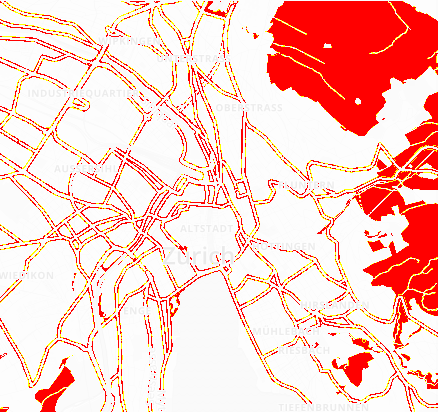
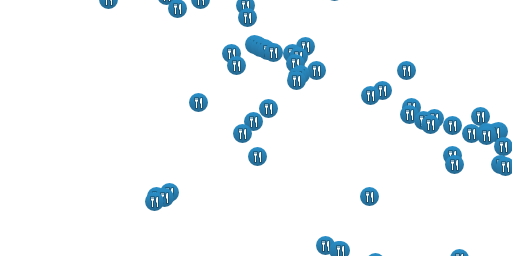
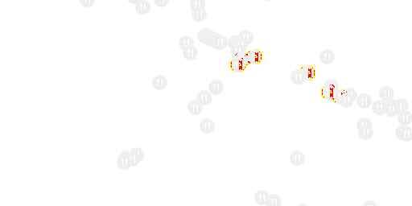
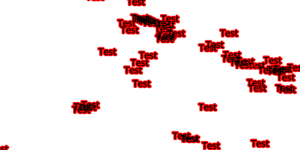
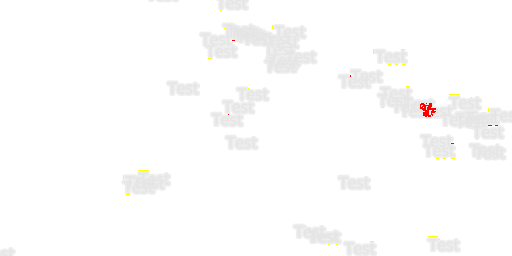

## pixelmatch

[](https://travis-ci.org/mapbox/pixelmatch)
[](https://coveralls.io/github/mapbox/pixelmatch?branch=master)
[](https://github.com/mourner/projects)

The smallest, simplest and fastest JavaScript pixel-level image comparison library,
originally created to compare screenshots in tests.

Features accurate **anti-aliased pixels detection**
and **perceptual color difference metrics**.

Inspired by [Resemble.js](https://github.com/Huddle/Resemble.js)
and [Blink-diff](https://github.com/yahoo/blink-diff).
Unlike these libraries, pixelmatch is around **90 lines of code**,
has **no dependencies**, and works on **raw arrays** of image data,
so it's **blazing fast** and can be used in **any environment** (Node or browsers).

```js
var numDiffPixels = pixelmatch(img1, img2, diff, 800, 600, {threshold: 0.1});
```

Implements ideas from the following papers:

- [Measuring perceived color difference using YIQ NTSC transmission color space in mobile applications](http://www.progmat.uaem.mx:8080/artVol2Num2/Articulo3Vol2Num2.pdf) (2010, Yuriy Kotsarenko, Fernando Ramos)
- [Anti-aliased pixel and intensity slope detector](http://www.ee.ktu.lt/journal/2009/7/25_ISSN_1392-1215_Anti-aliased%20Pxel%20and%20Intensity%20Slope%20Detector.pdf) (2009, Vytautas Vyšniauskas)

### Example output

| expected | actual | diff |
| --- | --- | --- |
|  |  |  |
|  |  |  |
|  |  |  |

### API

#### pixelmatch(img1, img2, output, width, height[, options])

- `img1`, `img2` — Image data of the images to compare (`Buffer` or `Uint8Array`).
- `output` — Image data to write the diff to, or `null` if don't need a diff image.
- `width`, `height` — Width and height of the images. Note that _all three images_ need to have the same dimensions.

`options` is an object literal with the following properties:

- `threshold` — Matching threshold, ranges from `0` to `1`. Smaller values make the comparison more sensitive. `0.1` by default.
- `includeAA` — If `true`, disables detecting and ignoring anti-aliased pixels. `false` by default.

Compares two images, writes the output diff and returns the number of mismatched pixels.

### Command line

Pixelmatch comes with a binary that works with PNG images:

```bash
pixelmatch image1.png image2.png output.png 0.1
```

### Example usage

#### Node.js

```js
var fs = require('fs'),
    PNG = require('pngjs').PNG,
    pixelmatch = require('pixelmatch');

var img1 = fs.createReadStream('img1.png').pipe(new PNG()).on('parsed', doneReading),
    img2 = fs.createReadStream('img2.png').pipe(new PNG()).on('parsed', doneReading),
    filesRead = 0;

function doneReading() {
    if (++filesRead < 2) return;
    var diff = new PNG({width: img1.width, height: img1.height});

    pixelmatch(img1.data, img2.data, diff.data, img1.width, img1.height, {threshold: 0.1});

    diff.pack().pipe(fs.createWriteStream('diff.png'));
}
```

#### Browsers

```js
var img1 = img1Ctx.getImageData(0, 0, width, height),
    img2 = img2Ctx.getImageData(0, 0, width, height),
    diff = diffCtx.createImageData(width, height);

pixelmatch(img1.data, img2.data, diff.data, width, height, {threshold: 0.1});

diffCtx.putImageData(diff, 0, 0);
```

### Install

Install with NPM:

```bash
npm install pixelmatch
```

To build a browser-compatible version, clone the repository locally, then run:

```bash
npm install -g browserify
browserify -s pixelmatch index.js > pixelmatch.js
```

### [Changelog](https://github.com/mapbox/pixelmatch/releases)
